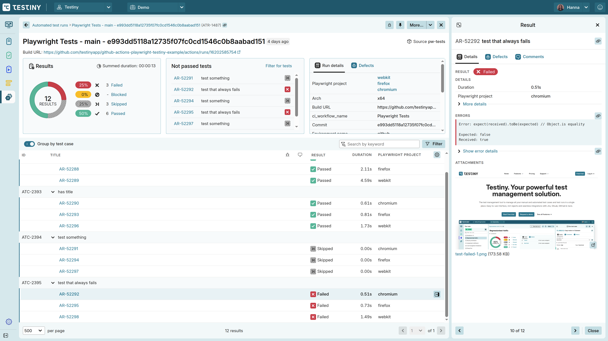

# GitHub Actions - Playwright - Testiny Example

This repository contains the following examples on how run test automation jobs with GitHub Actions and Playwright and report results to Testiny:

* Testiny Playwright Reporter ([.github/workflows/playwright-reporter.yml](.github/workflows/playwright-reporter.yml))
* Playwright JSON reports ([.github/workflows/playwright.yml](.github/workflows/playwright.yml))
* Playwright JUnit XML reports ([.github/workflows/playwright-junit.yml](.github/workflows/playwright-junit.yml))
* Report parallel/sharded Playwright tests to Testiny ([.github/workflows/playwright-sharded.yml](.github/workflows/playwright-sharded.yml))

The [Testiny Playwright Reporter](https://www.npmjs.com/package/@testiny/automation) can be configured in the Playwright config. Alternatively, you can also use the [Testiny CLI](https://www.testiny.io/docs/automation/cli/) to import Playwright JSON or JUnit reports.
Finally, this repository also include an example on how to run your Playwright tests in parallel with GitHub Actions and how to report the sharded results into Testiny.

The Playwright config is set to execute the sample tests on three different browsers.

The Testiny CLI supports Playwright JSON reports with `--playwright` option and JUnit-style reports with `--junit`.

The Reporter/CLI also imports screenshots for failed tests. If another screenshots folder is configured andthe CLI cannot find the screenshots, specify another relative base directory path with `attachmentPath`/`--attachment-path <FILE-PATH>`.

When the Reporter/CLI is executed in a CI/CD pipline, such as GitHub Actions, the CLI also automatically imports fields such as the pipeline build URL, the workflow name, etc. If you want to set additional fields use `fixedValue`/`--field-values` option.

To import [Playwright test annotations](https://playwright.dev/docs/test-annotations#annotate-tests), specify the annotation types with `customResultField`/`--custom-result-fields`.

An imported run from this repository in Testiny:




### Run tests locally

```sh
npm install
npx playwright install --with-deps
npx playwright test
```
